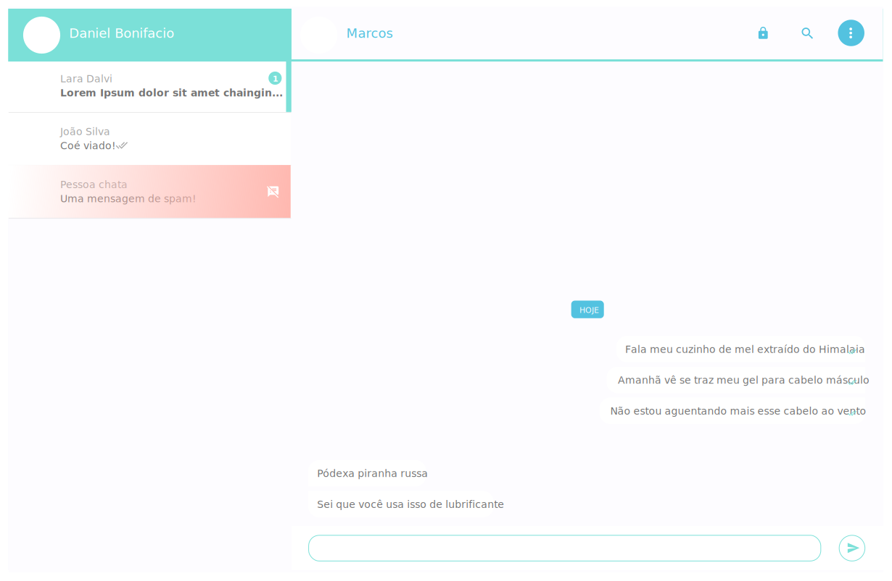

# ChatZap

  

O Chat Zap nada mais é do que uma cópia fajuta do WhatsApp Web. Ele está sendo desenvolvido em React e Node, com Socket.io.

Este projeto foi desenvolvido por [Daniel Bonifacio](https://danielbonifacio.com.br) e [Marcos Vinicius](https://github.com/Marcos1305).

## Documentação

### `components/ChatTrigger`

Existem algumas situações para renderizar os gatilhos de chats. As mais comuns são: mensagens não lidas/mensagens lidas.

**Como diferenciar uma da outra?**

Se a propriedade `messages` for `instanceof` de um `Array`, é assumido que existem mais de uma mensagem, logo:

1. Haverá necessidade de um counter; logo
2. As mensagens não foram lidas ainda.

**Este projeto está em fase de desenvolvimento. Ou seja: Não tá pronto ainda!**